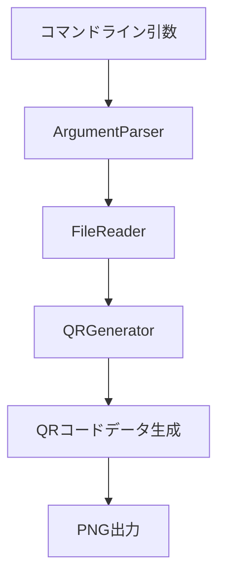

# QRコード生成プロジェクト 設計書

## システム構成

### 1. コアコンポーネント


### 2. 技術スタック
- コマンドライン解析: commander
- QRコード生成: qrcode
- ファイル操作: Node.js fs モジュール

### 3. モジュール設計

#### 3.1 ディレクトリ構造
```
qr-generator/
├── src/
│   ├── index.js          # メインエントリーポイント（コマンドライン処理）
│   ├── argParser.js      # コマンドライン引数解析
│   ├── qrGenerator.js    # QRコード生成
│   ├── fileReader.js     # ファイル読み込み
│   └── errors.js         # エラー定義
├── bin/
│   └── qr-generator      # 実行スクリプト
└── package.json
```

#### 3.2 クラス構造
```javascript
// ArgumentParser クラス
class ArgumentParser {
    static parse(args) {
        // コマンドライン引数を解析し、設定オブジェクトを返す
        // 色指定のバリデーションを含む
    }

    static validateColor(value) {
        // カラーコードのバリデーション (#000000 形式)
    }
}

// QRGenerator クラス
class QRGenerator {
    constructor(options) {
        this.options = {
            width: options.size || 256,
            errorCorrectionLevel: options.error || 'M',
            margin: options.margin || 4,
            color: {
                dark: options.darkColor || '#000000',
                light: options.lightColor || '#ffffff'
            }
        };
    }

    async generateQRImage(text, outputPath) {
        // QRコードを生成しPNG形式で保存
    }

    validateOptions() {
        // オプションのバリデーション（サイズ、色など）
    }
}
```

### 4. エラーハンドリング設計

#### 4.1 エラー定義
```javascript
// errors.js
const ErrorCodes = {
    FILE_NOT_FOUND: 'E0001',
    FILE_READ_ERROR: 'E0002',
    INVALID_OPTION: 'E0003',
    WRITE_ERROR: 'E0004',
    INVALID_COLOR: 'E0005'  // 色指定エラーを追加
};

const ErrorMessages = {
    [ErrorCodes.FILE_NOT_FOUND]: 'Input file not found: {path}',
    [ErrorCodes.FILE_READ_ERROR]: 'Failed to read file: {path}',
    [ErrorCodes.INVALID_OPTION]: 'Invalid {option}: {value} ({details})',
    [ErrorCodes.WRITE_ERROR]: 'Failed to write output file: {path}',
    [ErrorCodes.INVALID_COLOR]: 'Invalid color format: {color} (must be #RRGGBB format)'
};
```

#### 4.2 バリデーションルール
1. ファイルパス
   - 存在確認
   - 読み込み権限確認
   - 相対パス解決

2. オプション値
   - サイズ: 正の整数（128-1024）
   - エラー訂正レベル: L, M, Q, H のいずれか
   - マージン: 正の整数（0-10）
   - 出力パス: 書き込み権限のある有効なパス
   - 色指定: 16進数カラーコード（#RRGGBB形式）

### 5. コマンドライン引数
```bash
Options:
  -s, --size <number>      QRコードのサイズ（ピクセル）(デフォルト: 256)
  -e, --error <L|M|Q|H>    エラー訂正レベル (デフォルト: M)
  -m, --margin <number>    マージン（セル単位）(デフォルト: 4)
  -o, --output <path>      出力ファイル名 (デフォルト: qr-output.png)
  -d, --dark <color>       QRコードの暗い部分の色 (デフォルト: #000000)
  -l, --light <color>      QRコードの明るい部分の色 (デフォルト: #ffffff)
  -h, --help              ヘルプを表示