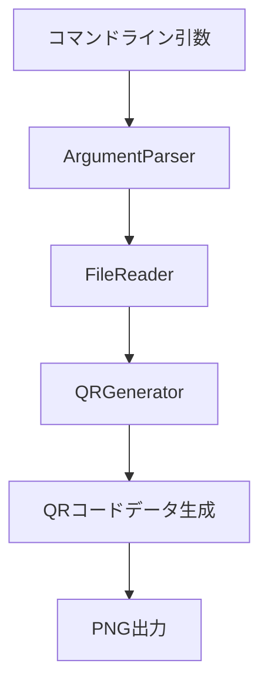

# QRコード生成プロジェクト 設計書

## システム構成

### 1. コアコンポーネント


### 2. 技術スタック
- コマンドライン解析: commander
- QRコード生成: qrcode
- ファイル操作: Node.js fs モジュール

### 3. モジュール設計

#### 3.1 ディレクトリ構造
```
qr-generator/
├── src/
│   ├── index.js          # メインエントリーポイント（コマンドライン処理）
│   ├── argParser.js      # コマンドライン引数解析
│   ├── qrGenerator.js    # QRコード生成
│   ├── fileReader.js     # ファイル読み込み
│   └── errors.js         # エラー定義
├── bin/
│   └── qr-generator      # 実行スクリプト
└── package.json
```

#### 3.2 実装詳細

##### bin/qr-generator
```javascript
#!/usr/bin/env node
require('../src/index.js');
```

##### package.json
```json
{
  "name": "qr-generator",
  "version": "1.0.0",
  "bin": {
    "qr-generator": "./bin/qr-generator"
  },
  "dependencies": {
    "commander": "^11.0.0",
    "qrcode": "^1.5.3"
  }
}
```

##### src/argParser.js
```javascript
const { Command } = require('commander');

class ArgumentParser {
    static parse(args) {
        const program = new Command();
        
        program
            .option('-s, --size <number>', 'QRコードのサイズ（ピクセル）', this.validateSize, 256)
            .option('-e, --error <level>', 'エラー訂正レベル', this.validateErrorLevel, 'M')
            .option('-m, --margin <number>', 'マージン（セル単位）', this.validateMargin, 4)
            .option('-o, --output <path>', '出力ファイル名', 'qr-output.png')
            .argument('[input]', '入力ファイル', 'qr-text.txt');

        program.parse(args);
        return program.opts();
    }

    static validateSize(value) {
        const size = parseInt(value);
        if (isNaN(size) || size < 128 || size > 1024) {
            throw new Error('サイズは128から1024の間で指定してください');
        }
        return size;
    }

    static validateErrorLevel(value) {
        if (!['L', 'M', 'Q', 'H'].includes(value)) {
            throw new Error('エラー訂正レベルはL, M, Q, Hのいずれかを指定してください');
        }
        return value;
    }

    static validateMargin(value) {
        const margin = parseInt(value);
        if (isNaN(margin) || margin < 0 || margin > 10) {
            throw new Error('マージンは0から10の間で指定してください');
        }
        return margin;
    }
}
```

##### src/index.js
```javascript
const ArgumentParser = require('./argParser');
const FileReader = require('./fileReader');
const QRGenerator = require('./qrGenerator');
const { QRGeneratorError, ErrorCodes } = require('./errors');

async function main() {
    try {
        // コマンドライン引数の解析
        const options = ArgumentParser.parse(process.argv);
        
        // 入力ファイルの読み込み
        const text = await FileReader.readFile(options.input);
        
        // QRコード生成
        const generator = new QRGenerator(options);
        await generator.generateQRImage(text, options.output);
        
        console.log(`QRコードを生成しました: ${options.output}`);
        process.exit(0);
    } catch (error) {
        if (error instanceof QRGeneratorError) {
            console.error(`Error [${error.code}]: ${error.message}`);
            if (error.details) {
                console.error(`詳細: ${error.details}`);
            }
        } else {
            console.error('予期せぬエラーが発生しました:', error.message);
        }
        process.exit(1);
    }
}

main();
```

### 4. エラーハンドリング設計

#### 4.1 エラー定義（src/errors.js）
```javascript
const ErrorCodes = {
    FILE_NOT_FOUND: 'E0001',
    FILE_READ_ERROR: 'E0002',
    INVALID_OPTION: 'E0003',
    WRITE_ERROR: 'E0004'
};

const ErrorMessages = {
    [ErrorCodes.FILE_NOT_FOUND]: 'Input file not found: {path}',
    [ErrorCodes.FILE_READ_ERROR]: 'Failed to read file: {path}',
    [ErrorCodes.INVALID_OPTION]: 'Invalid {option}: {value} ({details})',
    [ErrorCodes.WRITE_ERROR]: 'Failed to write output file: {path}'
};

class QRGeneratorError extends Error {
    constructor(code, params, details = null) {
        const message = ErrorMessages[code].replace(
            /\{(\w+)\}/g,
            (_, key) => params[key]
        );
        super(message);
        this.code = code;
        this.details = details;
    }
}

module.exports = {
    ErrorCodes,
    QRGeneratorError
};
```

#### 4.2 バリデーションルール
1. ファイルパス
   - 存在確認: fs.existsSync()を使用
   - 読み込み権限確認: fs.accessSync()を使用
   - 相対パス解決: path.resolve()を使用

2. オプション値
   - サイズ: 正の整数（128-1024）
   - エラー訂正レベル: L, M, Q, H のいずれか
   - マージン: 正の整数（0-10）
   - 出力パス: 書き込み権限のある有効なパス

#### 4.3 エラー出力フォーマット
```
Error [エラーコード]: エラーメッセージ
詳細: エラーの詳細な説明
```

### 5. インストールと実行方法

1. インストール
```bash
# グローバルインストール
npm install -g

# ローカルインストール
npm install
```

2. 実行権限の設定
```bash
chmod +x ./bin/qr-generator
```

3. シンボリックリンクの作成（開発時）
```bash
npm link